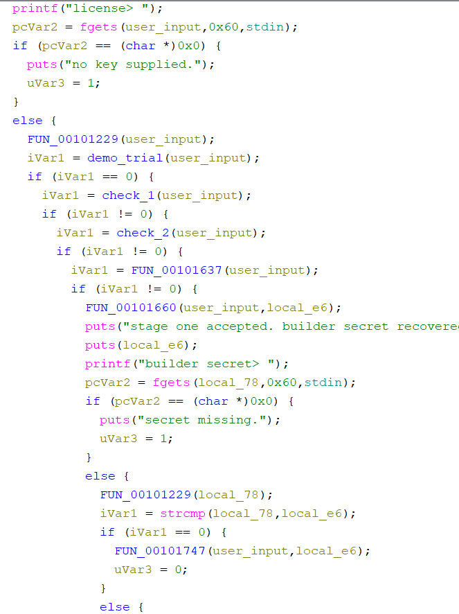
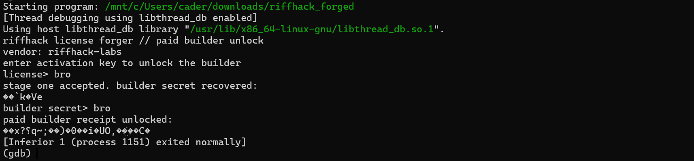
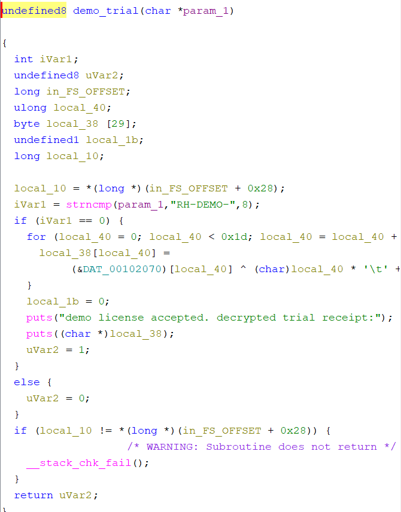
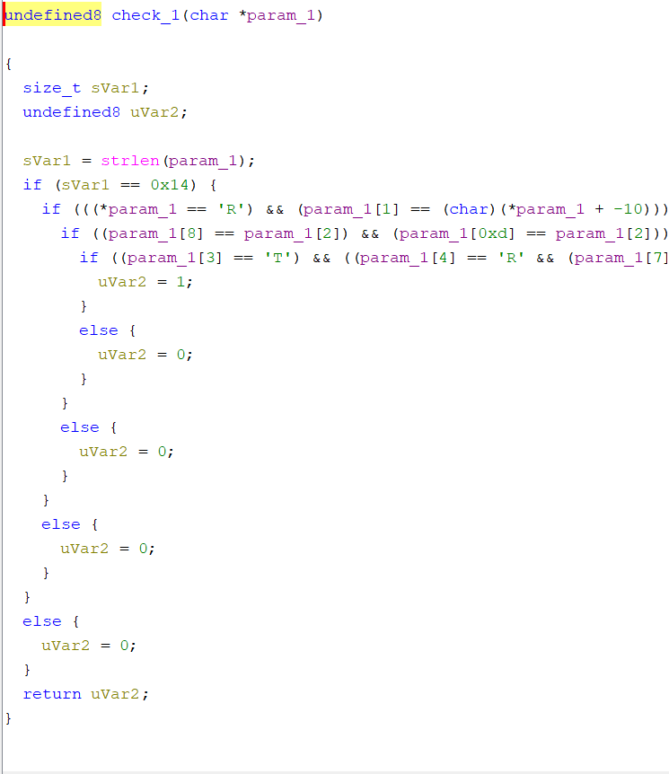
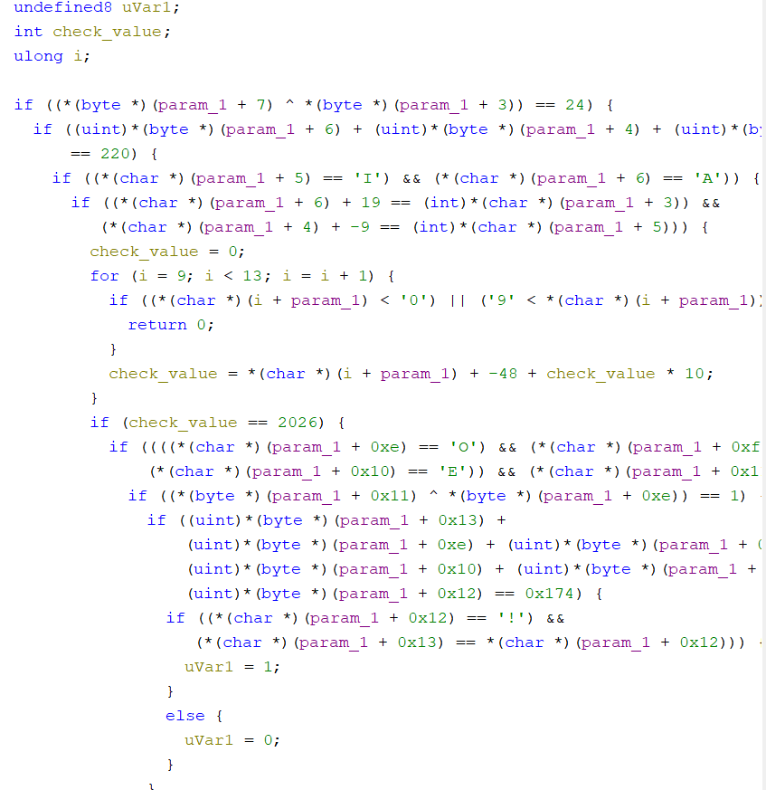
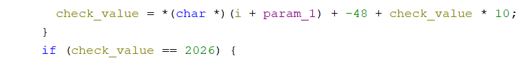
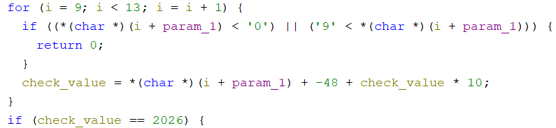
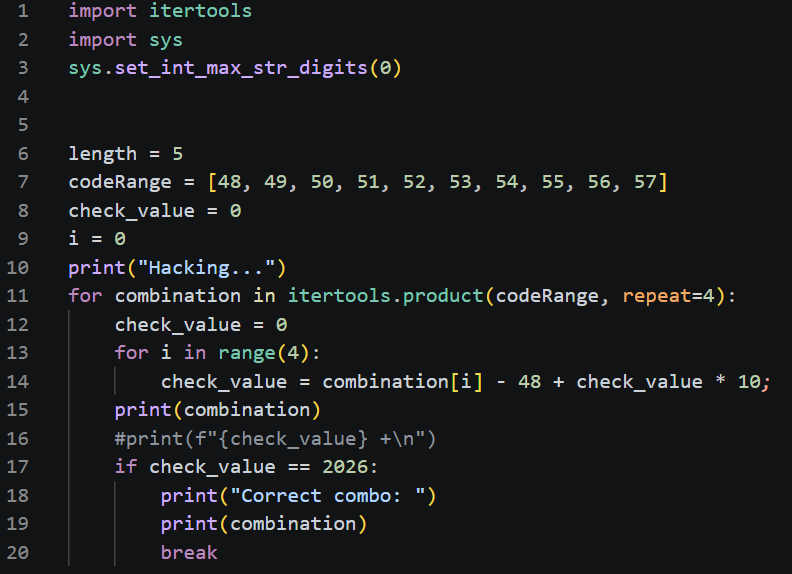
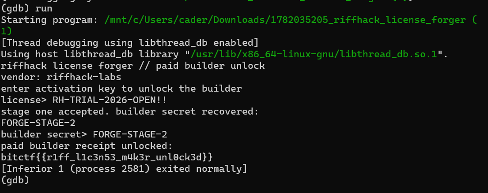

#Black-Market Break-In: Riffhack License Forger

###The plan: Make the program provide paid access
###The technique: Reverse engineering
###The tools: Ghidra and decimal converters

Wooh! This was a tough one. I’ve been battling with reverse engineering for a while, so I really wanted to give this challenge a go. 

After opening up Ghidra and giving the code a review, I noticed there were a ton of conditionals. If statements all down the line:

(For those of you following along, I changed some of the function and variable names. It actually made it a lot more approachable)

I originally tried to figure out the conditions, but the assembly language and C tripped me up. I gave another approach a shot: patch the instructions and bypass all the checks. I made most of the conditions the opposite of what they were (JZ to JNZ or JNZ to JZ). That way, I can just force my way through the program no matter what I enter. Right? 

Sigh. It turns out the key and flag are based on user input. So anything that isn’t the right password will spit out some broken nonsense. By this point, I had already spent hours grinding away at this. But I wasn’t done. 

I came back the next day with some fresh eyes. I knew that my only option was my initial approach: review the conditions and figure out the key. It would take time, but I knew that it was the right way. 

Our first if statement isn’t really relevant, since it only checks to see if we have a demo key. I realized later this was useless. We should ignore this all together. 

We don’t want that! We need the paid version!

Heading to the next condition, I realize two major things:
The key is 20 characters long
The first portion of the key starts with RH-T

I made a table with indices mapped to the characters:
| R | H | - | T | R |   |   | L | - |   |    |    |    | -  |    |    |    |    |    |    |
|---|---|---|---|---|---|---|---|---|---|----|----|----|----|----|----|----|----|----|----|
| 0 | 1 | 2 | 3 | 4 | 5 | 6 | 7 | 8 | 9 | 10 | 11 | 12 | 13 | 14 | 15 | 16 | 17 | 18 | 19 |

Onto our second if statement. Now it’s the next if statement. Hold on tight, things are about to get crazier!

As a newbie, I felt really overwhelmed. I played around with the first XOR statement, only to realize I didn’t really need to figure out what that meant. The value of these indices would already be confirmed by the if statement below. And then there was this:

We’re going to skip that for now. I ended up thinking I could ignore that, but I actually had to circle back around to that at the end. 
| R | H | - | T | R | I | A | L | - |   |    |    |    | -  | O  | P  | E  | N  | !  | !  |
|---|---|---|---|---|---|---|---|---|---|----|----|----|----|----|----|----|----|----|----|
| 0 | 1 | 2 | 3 | 4 | 5 | 6 | 7 | 8 | 9 | 10 | 11 | 12 | 13 | 14 | 15 | 16 | 17 | 18 | 19 |

Index 19  was based on a comparison. It was labeled the same as 18. I actually used the above if condition and added the values together:

= param[19] + param[14] + param[15] + param[16] + param[17] + param[18] = 372
= unknown + 79 + 80 + 69 + 78 + 33 = 372
= unknown + 339 = 372
So unknown is 33, which is an exclamation point.

Now let’s go back around to the for loop!

This loop actually has a purpose (that I chose to gloss over before). This is where things get really tricky. The for loop checks the indices from 9-12. The letter can’t have an ASCII value below 48 or above 57. 

The variable local_14, which I changed to check_value, is then set to the parameter - 48 + the previous local_14 variable times 10. After the code is done, check_value needs to equal 2026.
 

(I changed the variable names in the for loop to make it look less hairy)

So we have some constraints, but we don’t actually know any of the values.* I thought that since this code was so short, I could just brute force it. With a template from Google’s AI, I whipped up an algorithm in Visual Studio Code:
 

It uses the same logic check as the original program, only this time it pumps in different combinations of code. 

It came back with (50, 48, 50, 54). Did a little math and it fit the bill. Converting to ASCII revealed 2026. Of course.

| R | H | - | T | R | I | A | L | - | 2 | 0  | 2  | 6  | -  | O  | P  | E  | N  | !  | !  |
|---|---|---|---|---|---|---|---|---|---|----|----|----|----|----|----|----|----|----|----|
| 0 | 1 | 2 | 3 | 4 | 5 | 6 | 7 | 8 | 9 | 10 | 11 | 12 | 13 | 14 | 15 | 16 | 17 | 18 | 19 |

The final code? 
RH-TRIAL-2026-OPEN!!
 

 
Flag in the bag! Let’s go!

Fun facts:
I didn’t know what I was doing the entire time 
The conditionals confused me constantly, specifically for the numbers in the middle
Patching the instructions wasted so much time and led nowhere. 
I need to get better at assembly!
*I’m not sure I was actually supposed to brute force the program. I feel like I’m missing something. 
I used ASCII and hex converters throughout this. Little did I know, Ghidra actually lets you do that. It definitely made things MUCH easier. 

I was always intimidated by reverse engineering. Luckily, I’m learning to understand the tools and techniques a little bit better. 
