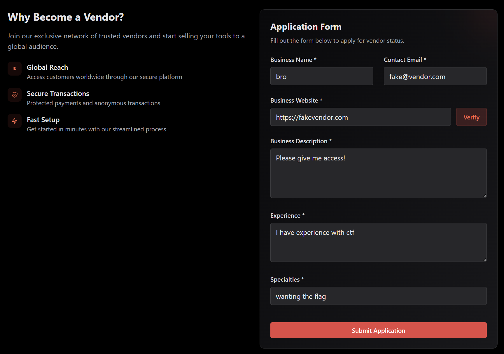

Black Market Break-In: The Vendor’s Secret Door

The plan: Gain access to the special vendor view. 
The technique: Cookie manipulation
The tools: JWT.io

In the Black Market Break-In CTF by Biterra, we have access to a special website that offers black market hacking services. For this challenge, we need to gain vendor access. 

First, I attempted to create an account as a vendor. When this didn’t work, I tried to make certain fields optional. I added bogus details and even experimented with SQL injections. 

This went nowhere. I had wasted too much time with this, so I decided to take a break and try another challenge (I don’t remember which). This involved playing around with the site and stumbling upon this cookie:

I looked up the cookie to figure out how to decode it. I found out it was a JSON string that I could decode with JWT:

That’s where I knew I struck gold. There’s an option for vendor access that is set to “false”. Time to change that. I went into encode mode, wrote “true” for vendor access, and copied the cookie. I overrode the old cookie with the new one. 

Bingo! I was able to achieve instant vendor access. To be honest, this win caught me by surprise. Solving a medium difficulty challenge felt like a lofty goal. But this showed me that exploration and curiosity paved the way to discovery and success! 

Fun facts:
I had really wanted to solve this challenge because I thought the name sounded cool. “The Vendor’s Secret Door”. Ooh…
I had actually used JWT.io in the past for my job as a customer support representative at zyBooks. When the suggestion came up in my search, I recognized it immediately! I hadn’t used it much for work and didn’t even know how it worked, so I was happy to actually learn it.
